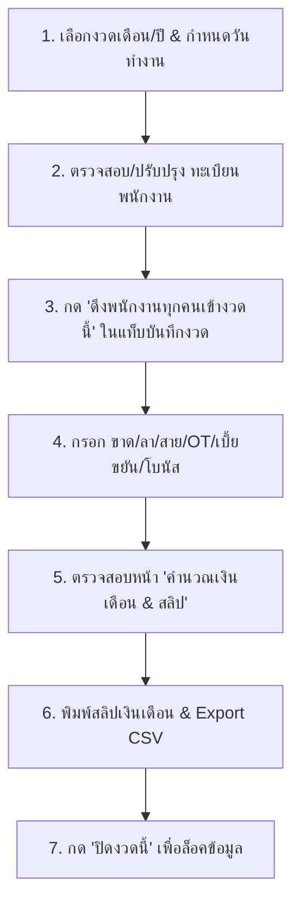

# คู่มือการใช้งานระบบบริหารจัดการเงินเดือน (User Manual)
## ระบบ PTN Payroll System V4.0
**บริษัท พีทีเอ็น ฟาร์มาเซ็นเตอร์ จำกัด (PTN Pharma Center Co., Ltd.)**

---

### 🌐 ลิงก์เข้าใช้งานระบบ
👉 **URL:** [https://master.ptn-payroll.pages.dev](https://master.ptn-payroll.pages.dev)

---

## สารบัญ (Table of Contents)
1. [ภาพรวมและสถาปัตยกรรมระบบ](#1-ภาพรวมและสถาปัตยกรรมระบบ)
2. [การเข้าสู่ระบบและระดับสิทธิ์ผู้ใช้งาน (RBAC)](#2-การเข้าสู่ระบบและระดับสิทธิ์ผู้ใช้งาน-rbac)
3. [ขั้นตอนการทำงานรอบเดือน (Monthly Payroll Workflow)](#3-ขั้นตอนการทำงานรอบเดือน-monthly-payroll-workflow)
   - [ขั้นตอนที่ 1: เลือกงวดประจำเดือนและตั้งค่าวันทำงาน](#ขั้นตอนที่-1-เลือกงวดประจำเดือนและตั้งค่าวันทำงาน)
   - [ขั้นตอนที่ 2: จัดการทะเบียนประวัติพนักงาน (Employee Master)](#ขั้นตอนที่-2-จัดการทะเบียนประวัติพนักงาน-employee-master)
   - [ขั้นตอนที่ 3: บันทึกข้อมูลประจำงวด (Monthly Input)](#ขั้นตอนที่-3-บันทึกข้อมูลประจำงวด-monthly-input)
   - [ขั้นตอนที่ 4: คำนวณเงินเดือนและพิมพ์สลิป (Payroll & Payslips)](#ขั้นตอนที่-4-คำนวณเงินเดือนและพิมพ์สลิป-payroll--payslips)
   - [ขั้นตอนที่ 5: การล็อคและปิดงวดบัญชี (Period Closing)](#ขั้นตอนที่-5-การล็อคและปิดงวดบัญชี-period-closing)
4. [คู่มือการใช้งานแต่ละเมนู (Module Guides)](#4-คู่มือการใช้งานแต่ละเมนู-module-guides)
   - [4.1 แดชบอร์ดสรุปภาพรวม (Dashboard)](#41-แดชบอร์ดสรุปภาพรวม-dashboard)
   - [4.2 ประวัติการทำงานและเงินเดือนย้อนหลังรายบุคคล (History)](#42-ประวัติการทำงานและเงินเดือนย้อนหลังรายบุคคล-history)
   - [4.3 ตั้งค่าข้อมูลบริษัท (Company Settings)](#43-ตั้งค่าข้อมูลบริษัท-company-settings)
   - [4.4 สำรองและกู้คืนฐานข้อมูล (Backup & Restore)](#44-สำรองและกู้คืนฐานข้อมูล-backup--restore)
   - [4.5 จัดการผู้ใช้งานระบบ (User Management)](#45-จัดการผู้ใช้งานระบบ-user-management)
5. [สูตรและหลักเกณฑ์การคำนวณเงินเดือน (Calculation Rules)](#5-สูตรและหลักเกณฑ์การคำนวณเงินเดือน-calculation-rules)
6. [คำถามที่พบบ่อยและการแก้ไขปัญหาเบื้องต้น (FAQ & Troubleshooting)](#6-คำถามที่พบบ่อยและการแก้ไขปัญหาเบื้องต้น-faq--troubleshooting)

---

## 1. ภาพรวมและสถาปัตยกรรมระบบ
ระบบ **PTN Payroll V4.0** เป็นเว็บแอปพลิเคชันบริหารจัดการเงินเดือนเต็มรูปแบบ พัฒนาขึ้นโดยใช้สถาปัตยกรรม Serverless ทำงานบนเครือข่าย **Cloudflare Pages** ร่วมกับฐานข้อมูล SQL **Cloudflare D1**
* **ความเร็วสูง**: โหลดข้อมูลรวดเร็วแบบ Single Page Application (SPA)
* **ความปลอดภัยระดับองค์กร**: แยกสิทธิ์ผู้ใช้งานแบบ Role-Based Access Control (RBAC) ป้องกันการรั่วไหลของข้อมูลเงินเดือน
* **รองรับการใช้งานต่อเนื่อง**: ไม่หลุดออกจากระบบเมื่อกด Refresh (F5) และจดจำงวดที่ทำงานล่าสุดเสมอ
* **ระบบป้องกันแคช**: มี Header Anti-Cache เพื่อให้ข้อมูลทุกตารางอัปเดตแบบเรียลไทม์เสมอ

---

## 2. การเข้าสู่ระบบและระดับสิทธิ์ผู้ใช้งาน (RBAC)

### บัญชีผู้ใช้งานเริ่มต้น
* **Username**: `admin`
* **Password**: `123456`

### ตารางเปรียบเทียบสิทธิ์การใช้งาน (Role Permissions)

| เมนู / ฟังก์ชัน | Admin / HR (ผู้ดูแลระบบ) | HR (ฝ่ายบุคคล/บัญชี) | User (ผู้ใช้งานทั่วไป) |
|---|:---:|:---:|:---:|
| 📊 แดชบอร์ดสรุปภาพรวม (Dashboard) | ✅ เห็นครบถ้วน | ✅ เห็นครบถ้วน | ❌ ซ่อน |
| 🧮 คำนวณเงินเดือน & พิมพ์สลิป (Payroll) | ✅ จัดการได้ทั้งหมด | ✅ จัดการได้ทั้งหมด | ❌ ซ่อน |
| 📅 บันทึกข้อมูลประจำงวด (Monthly Input) | ✅ จัดการได้ทั้งหมด | ✅ จัดการได้ทั้งหมด | ❌ ซ่อน |
| 👥 ทะเบียนพนักงาน: ดูข้อมูลทั่วไป | ✅ เห็นทุกข้อมูล | ✅ เห็นทุกข้อมูล | ✅ เห็นเฉพาะข้อมูลทั่วไป |
| 💰 ทะเบียนพนักงาน: ดู/แก้ไข เงินเดือนฐาน | ✅ จัดการได้ | ✅ จัดการได้ | ❌ **ซ่อน 100%** |
| ➕ ทะเบียนพนักงาน: เพิ่ม/แก้ไข ข้อมูลทั่วไป | ✅ ทำได้ | ✅ ทำได้ | ✅ ทำได้ (เงินเดือนเดิมไม่หาย) |
| 🗑️ ทะเบียนพนักงาน: ลบพนักงาน | ✅ ลบได้ | ✅ ลบได้ | ❌ **ซ่อนปุ่มลบ** |
| 📜 ประวัติย้อนหลังรายคน (History) | ✅ ดูและพิมพ์ได้ | ✅ ดูและพิมพ์ได้ | ❌ ซ่อน |
| 🏢 ตั้งค่าข้อมูลบริษัท (Company Settings) | ✅ จัดการได้ | ❌ ซ่อน | ❌ ซ่อน |
| 💾 สำรอง/กู้คืนฐานข้อมูล (Backup & Restore) | ✅ จัดการได้ | ❌ ซ่อน | ❌ ซ่อน |
| 👤 จัดการผู้ใช้งานระบบ (User Management) | ✅ จัดการได้ | ❌ ซ่อน | ❌ ซ่อน |

---

## 3. ขั้นตอนการทำงานรอบเดือน (Monthly Payroll Workflow)

### ขั้นตอนที่ 1: เลือกงวดประจำเดือนและตั้งค่าวันทำงาน
1. ที่แถบด้านบนสุด (Period Bar) เลือก **เดือน** และ **ปี พ.ศ.** (ระบบรองรับย้อนหลัง 5 ปี และล่วงหน้า 20 ปี)
2. ในช่อง **"วันทำงานในงวด"** กรอกจำนวนวันทำงานจริงของเดือนนั้น (ค่าเริ่มต้นคือ `30` วัน)
3. กดปุ่ม **"Set"** เพื่อบันทึกวันทำงานนำไปใช้คำนวณอัตราค่าจ้างต่อวันของพนักงานทุกคนในงวดทันที

---

### ขั้นตอนที่ 2: จัดการทะเบียนประวัติพนักงาน (Employee Master)
เปิดแท็บ **"ทะเบียนพนักงาน"** เพื่อบันทึกและจัดการข้อมูลพนักงานของบริษัท:
1. **เพิ่มพนักงานใหม่**: กดปุ่ม **"+ เพิ่มพนักงาน"** กรอกข้อมูล:
   * **รหัสพนักงาน** (เช่น `EMP001`), **ชื่อ-นามสกุล**, **ชื่อเล่น**
   * **วันเกิด**: เมื่อเลือกวันที่ ระบบจะคำนวณ **อายุ (ปี)** ให้โดยอัตโนมัติ
   * **บัตรประชาชน, เบอร์โทร, ที่อยู่, แผนก, ตำแหน่ง, ธนาคาร, เลขบัญชี, วันเริ่มงาน**
   * **เงินเดือนฐาน (บาท)**
   * **กองทุนสำรองเลี้ยงชีพ (PF)**:
     * ติ๊กถูก `[✓] เข้าร่วมกองทุน (หัก PF)` &rarr; ระบุอัตรา เช่น `0.05` (5%)
     * ติ๊กออก `[ ] เข้าร่วมกองทุน (หัก PF)` &rarr; สำหรับพนักงานที่ไม่เข้าร่วม (ระบบจะไม่หัก PF = ฿0.00)
   * **ประกันสังคม (SSO)**:
     * ติ๊กถูก `[✓] หักประกันสังคม (SSO)` &rarr; ระบุตัวเลขยอดหัก เช่น `750`
     * ติ๊กออก `[ ] หักประกันสังคม (SSO)` &rarr; สำหรับคนที่ไม่หักประกันสังคม (ระบบจะไม่หัก SSO = ฿0.00)
   * **ภาษีเริ่มต้น (Tax Default)**
   * **หมายเหตุ (Remark)**: สำหรับระบุข้อมูลเพิ่มเติม เช่น *พนักงานทดลองงาน, สัญญาจ้างชั่วคราว*
2. **การแก้ไขพนักงาน**: กดปุ่ม **"✏️ แก้ไข"** ที่แถวพนักงานที่ต้องการ
   > *ข้อดี: เมื่อแก้ไขข้อมูลพนักงาน ระบบจะ Real-time Auto-Sync อัปเดตข้อมูลไปยังงวดปัจจุบันทันที*
3. **การนำเข้า/ส่งออกไฟล์ CSV**:
   * กด **"📄 Export CSV"** เพื่อดาวน์โหลดรายชื่อพนักงานทั้งหมดเป็นไฟล์ Excel/CSV
   * กด **"📥 Import CSV"** เพื่อนำเข้าพนักงานจำนวนมากพร้อมกันผ่านไฟล์ CSV

---

### ขั้นตอนที่ 3: บันทึกข้อมูลประจำงวด (Monthly Input)
เปิดแท็บ **"บันทึกข้อมูลประจำงวด"**:
1. กดปุ่มสีเหลือง **"👥 ดึงพนักงานทุกคนเข้างวดนี้"**:
   * ระบบจะดึงพนักงานทุกคนจากทะเบียนพนักงานเข้ามาในงวด พร้อมเงินเดือนฐาน, กองทุน PF, ประกันสังคม, ภาษี และอัตรา OT เริ่มต้นที่ **40 บาท/ชม.**
2. **กรอกข้อมูลการทำงานของพนักงานแต่ละคน**:
   * กดปุ่ม **"✏️ แก้ไข"** ที่แถวของพนักงานคนนั้น หรือกด **"+ บันทึกข้อมูลรายคน"**
   * กรอกวัน **ขาดงาน (วัน)**, **ลากิจ (วัน)**, **ลาป่วย (วัน)**
   * กรอกยอด **หักมาสาย (บาท)**
   * กรอกจำนวนชั่วโมง **OT (ชม.)** (ระบบจะคำนวณเงิน OT จากสูตร: `ชั่วโมง OT × อัตรา OT 40 บาท` ให้อัตโนมัติ)
   * กรอก **เบี้ยขยัน (บาท)**, **เงินรางวัล/โบนัส (บาท)**
   * กรอกยอด **หักเงินเบิก/เงินยืม (บาท)** และ **หักอื่น ๆ (บาท)**
   * กดปุ่ม **"บันทึกข้อมูลประจำงวด"**

---

### ขั้นตอนที่ 4: คำนวณเงินเดือนและพิมพ์สลิป (Payroll & Payslips)
เปิดแท็บ **"คำนวณเงินเดือน & สลิป"**:
1. ตารางจะแสดงผลการคำนวณเงินเดือนครบถ้วน **20 คอลัมน์** แบบเรียลไทม์
2. หากมีการแก้ไขข้อมูล สามารถกดปุ่ม **"⚡ ประมวลผลคำนวณเงินเดือน"** เพื่อให้ระบบรีเฟรชยอดคำนวณใหม่ได้ทันที
3. **การพิมพ์สลิปเงินเดือน**:
   * กดปุ่ม **"สลิป"** ที่แถวของพนักงานที่ต้องการ
   * หน้าต่างสลิปเงินเดือนจะแสดงรายละเอียดรายรับ, รายการหัก, ยอดเงินได้รวม (Gross Pay), ยอดหักรวม และเงินได้สุทธิ (Net Pay) พร้อมลายเซ็นผู้จ่ายเงินและผู้รับเงิน
   * กดปุ่ม **"🖨️ พิมพ์สลิปเงินเดือน"** เพื่อพิมพ์ออกเครื่องพิมพ์ หรือบันทึกเป็น PDF ขนาดมาตรฐาน A4
4. **การส่งออกรายงาน**: กดปุ่ม **"📄 Export CSV"** เพื่อดาวน์โหลดตารางสรุปเงินเดือนประจำงวดทั้งหมด

---

### ขั้นตอนที่ 5: การล็อคและปิดงวดบัญชี (Period Closing)
1. เมื่อตรวจสอบยอดเงินเดือนในงวดถูกต้องครบถ้วนแล้ว ให้ไปที่แถบด้านบน (Period Bar)
2. กดปุ่มสีแดง **"🔒 ปิดงวดนี้"**
   * ระบบจะประมวลผลคำนวณยอดเงินเดือนสุดท้าย และเปลี่ยนสถานะงวดเป็น **`ปิดงวดแล้ว`**
   * บันทึกวัน-เวลา และชื่อผู้ที่ทำการปิดงวดไว้เป็นหลักฐาน
3. หากต้องการแก้ไขข้อมูลเพิ่มเติมในภายหลัง ผู้ดูแลระบบสามารถกดปุ่ม **"🔓 ปลดล็อคงวด"** เพื่อเปิดให้แก้ไขข้อมูลใหม่ได้ตลอดเวลา

---

## 4. คู่มือการใช้งานแต่ละเมนู (Module Guides)

### 4.1 แดชบอร์ดสรุปภาพรวม (Dashboard)
* **การ์ดสรุปยอดเงินเดือน (4 การ์ดหลัก)**:
  1. 👥 **พนักงานทั้งหมดในงวด** (คน)
  2. 📈 **ยอดจ่ายรวม (Gross Pay)** (บาท)
  3. 📉 **ยอดหักทั้งหมด (Deductions)** (บาท)
  4. 💵 **ยอดจ่ายสุทธิ (Net Pay)** (บาท)
* **ช่องค้นหาเรียลไทม์**: พิมพ์รหัส, ชื่อ, หรือแผนก เพื่อกรองดูข้อมูลได้ทันที

---

### 4.2 ประวัติการทำงานและเงินเดือนย้อนหลังรายบุคคล (History)
1. เลือกรายชื่อพนักงานจากเมนู Dropdown
2. ระบบจะแสดง **การ์ดโปรไฟล์พนักงาน** (รหัส, ชื่อเล่น, วันเกิด, อายุ, เลขบัญชี, เงินเดือนฐาน ฯลฯ)
3. ตารางด้านล่างจะแสดง **ประวัติเงินเดือนย้อนหลังครบทุกงวด** (19 คอลัมน์) ของพนักงานคนนั้น
4. สามารถใช้ช่องค้นหาเพื่อค้นหางวด หรือกดปุ่ม **"🖨️ พิมพ์รายงานประวัติ"** เพื่อออกรายงานย้อนหลังได้

---

### 4.3 ตั้งค่าข้อมูลบริษัท (Company Settings)
* เข้าสู่แท็บ **"ข้อมูลบริษัท"** เพื่อระบุ:
  * **ชื่อบริษัท**: เช่น `บริษัท พีทีเอ็น ฟาร์มาเซ็นเตอร์ จำกัด`
  * **ที่อยู่สถานประกอบการ**
  * **เบอร์โทรศัพท์**
  * **เลขประจำตัวผู้เสียภาษีอากร (13 หลัก)**
* ข้อมูลนี้จะถูกนำไปแสดงบน **หัวสลิปเงินเดือน** และเอกสารรายงานทุกฉบับ

---

### 4.4 สำรองและกู้คืนฐานข้อมูล (Backup & Restore)
อยู่ในส่วนล่างของแท็บ **"ข้อมูลบริษัท"**:
1. **สำรองข้อมูล (Backup)**:
   * กดปุ่ม **"ดาวน์โหลด Backup (.json)"**
   * ระบบจะรวมข้อมูลทั้ง 5 ตารางในฐานข้อมูล (Settings, Users, Employees, Monthly Inputs, Payroll Calcs) เป็นไฟล์ `.json` ดาวน์โหลดลงเครื่องคอมพิวเตอร์
2. **กู้คืนข้อมูล (Restore)**:
   * กดปุ่ม **"เลือกไฟล์กู้คืน"** &rarr; เลือกไฟล์สำรอง `.json`
   * กดยืนยันการกู้คืน ข้อมูลทั้งหมดจะถูกเขียนกลับคืนสู่ฐานข้อมูลทันที

---

### 4.5 จัดการผู้ใช้งานระบบ (User Management)
เฉพาะผู้ใช้งานระดับ **Admin** เท่านั้นที่เข้าถึงเมนูนี้ได้:
1. **เพิ่มผู้ใช้งาน**: กด **"+ เพิ่มผู้ใช้งาน"** &rarr; กรอก Username, Password และเลือกระดับสิทธิ์ (`Admin / HR`, `HR`, `User`)
2. **แก้ไขผู้ใช้งาน**: กด **"✏️ แก้ไข"** เพื่อเปลี่ยนรหัสผ่านหรือระดับสิทธิ์
3. **ลบผู้ใช้งาน**: กด **"🗑️ ลบ"** (ระบบป้องกันไม่ให้ลบ Admin หลัก)

---

## 5. สูตรและหลักเกณฑ์การคำนวณเงินเดือน (Calculation Rules)

### ค่าจ้างต่อวัน (Daily Rate)
* **ค่าจ้างต่อวัน** = `เงินเดือนฐาน / จำนวนวันทำงานในงวด (เช่น 30 วัน)`

### 1. รายการหักการขาด ลา มาสาย (Leave Deductions)
* **หักขาดงาน** = `จำนวนวันขาด × ค่าจ้างต่อวัน × 1.5` *(หัก 1.5 เท่าตามระเบียบบริษัท)*
* **หักลากิจ** = `จำนวนวันลากิจ × ค่าจ้างต่อวัน × 1.0`
* **หักลาป่วย** = `จำนวนวันลาป่วย × ค่าจ้างต่อวัน × 1.0`
* **หักมาสาย** = `ยอดเงินหักสายที่ระบุโดยตรง (บาท)`
* **รวมยอดหักขาดลาสาย** = `หักขาดงาน + หักลากิจ + หักลาป่วย + หักมาสาย`

---

### 2. รายรับและเงินได้รวม (Gross Pay)
* **เงิน OT** = `ชั่วโมง OT × อัตรา OT (ค่าเริ่มต้น 40 บาท/ชม.)`
* **เงินได้รวม (Gross Pay)** = `เงินเดือนฐาน + เงิน OT + เบี้ยขยัน + โบนัส - รวมยอดหักขาดลาสาย`

---

### 3. รายการหักประจำเดือน (Monthly Deductions)
* **กองทุนสำรองเลี้ยงชีพ (PF)** = `เงินเดือนฐาน × อัตรา PF` *(หากไม่ได้เข้าร่วม = 0 บาท)*
* **ประกันสังคม (SSO)** = `ยอดเงินประกันสังคมที่ระบุ` *(หากไม่ได้หัก = 0 บาท)*
* **ภาษีหัก ณ ที่จ่าย** = `ยอดเงินภาษีที่ระบุ`
* **รวมยอดหักทั้งหมด (Total Deductions)** = `ประกันสังคม + กองทุน PF + ภาษี + หักเงินเบิก + หักอื่น ๆ`

---

### 4. เงินได้สุทธิ (Net Pay)
* **เงินได้สุทธิ (Net Pay)** = `เงินได้รวม (Gross Pay) - รวมยอดหักทั้งหมด (Total Deductions)`

---

## 6. คำถามที่พบบ่อยและการแก้ไขปัญหาเบื้องต้น (FAQ & Troubleshooting)

#### Q1: พนักงานบางคนไม่ต้องการหักกองทุน PF หรือประกันสังคม ต้องทำอย่างไร?
> **ตอบ:** ไปที่แท็บ **"ทะเบียนพนักงาน"** &rarr; กด **"✏️ แก้ไข"** พนักงานคนนั้น &rarr; ติ๊กเอาเครื่องหมายถูกตรง **"เข้าร่วมกองทุน (หัก PF)"** หรือ **"หักประกันสังคม (SSO)"** ออก แล้วกดบันทึก ระบบจะปรับยอดหักเป็น **฿0.00** ให้ทันทีอัตโนมัติ

#### Q2: อัตราค่าล่วงเวลา (OT) กำหนดอย่างไร?
> **ตอบ:** ค่าเริ่มต้นของระบบกำหนดอัตรา OT ไว้ที่ **40 บาทต่อชั่วโมง** ตามนโยบายบริษัท โดยท่านสามารถแก้ไขอัตรา OT รายคนในหน้าต่างบันทึกประจำงวดได้หากมีกรณีพิเศษ

#### Q3: หากกด Refresh (F5) หรือปิดเบราว์เซอร์แล้วเปิดใหม่ ข้อมูลจะหายหรือไม่?
> **ตอบ:** ไม่หายครับ ระบบมีกลไก Session Persistence จดจำการเข้าสู่ระบบและงวดประจำเดือนล่าสุดไว้ใน LocalStorage และข้อมูลทุกอย่างถูกจัดเก็บอย่างถาวรใน Cloudflare D1 SQL Database

#### Q4: หากต้องการพิมพ์สลิปเงินเดือนทุกคนในงวดทีเดียว ทำอย่างไร?
> **ตอบ:** ท่านสามารถกด **"Export CSV"** ในหน้าคำนวณเงินเดือนเพื่อนำข้อมูลไปใช้งาน หรือกดปุ่ม **"สลิป"** ในแต่ละแถวเพื่อสั่งพิมพ์สลิป A4 ทีละคนได้อย่างคมชัดสวยงาม

---
*เอกสารคู่มือจัดทำขึ้นสำหรับ บริษัท พีทีเอ็น ฟาร์มาเซ็นเตอร์ จำกัด โดยระบบ PTN Payroll V4.0*
